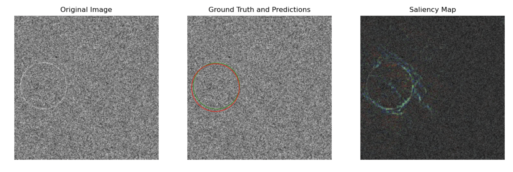
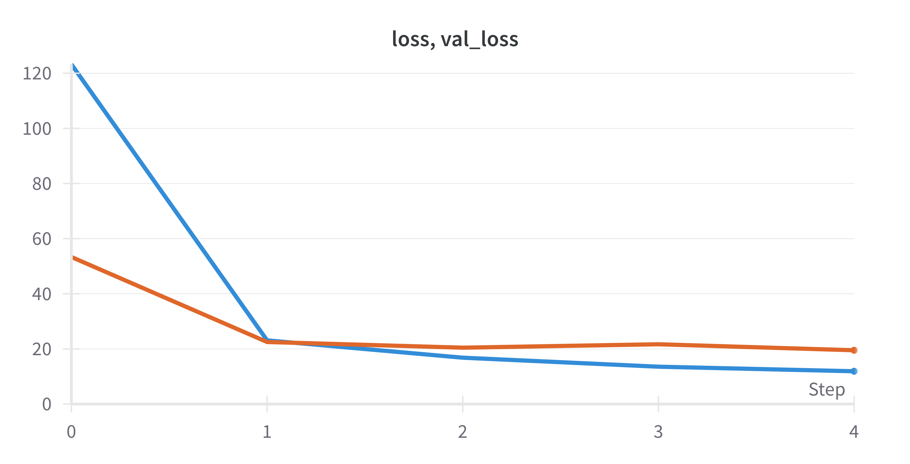
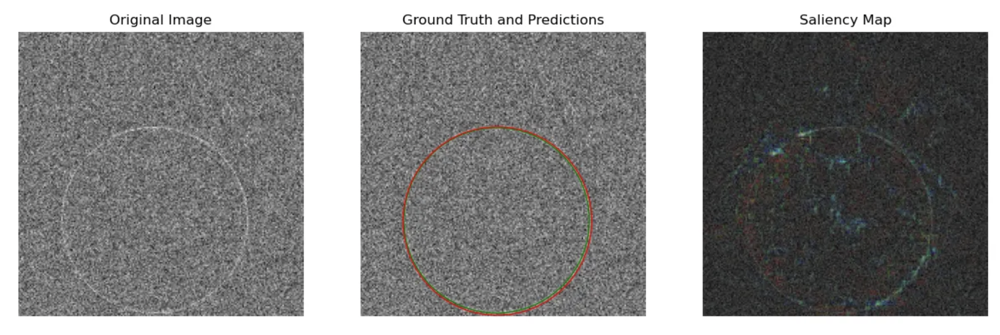
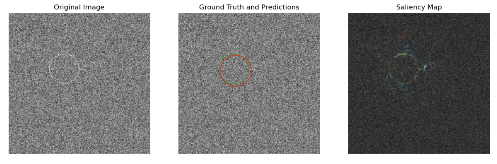

# Circle Detection with CNNs and Model Explainability



## Project Overview

This project focuses on training Convolutional Neural Networks (CNNs) to detect circles within images. Our objective extends beyond accuracy; we strive for model transparency, aiming to create a model whose decisions can be explained and understood. We delve into the theory behind our choices of loss functions and model architectures, providing insight into the trade-offs and benefits of each approach.

## Introduction

We have the capability to utilize a combination of architectures from our collection, which includes variations like ResNet, VGG, and MobileNet. Each architecture brings a different balance of parameter count and abstraction capability, affecting both performance and interpretability:

- **ResNet**: Known for its residual connections, which help in training deeper networks by addressing the vanishing gradient problem.
- **VGG**: Characterized by its simplicity and depth, which has proven to be effective in various vision tasks.
- **MobileNet**: Designed for mobile and edge devices, it uses depth-wise separable convolutions to reduce the model size and computational cost.

Note that we only utilize MobileNet as it trains quicker and is more lightweight, as opposed to reporting results on multiple benchmarks (although this repository has the capabilities for that). For loss functions, we employ Mean Squared Error (MSE) for its simplicity and effectiveness in regression tasks like ours. This choice is supported by the nature of our task, where we aim to minimize the difference between predicted and actual circle parameters.

## Results and Discussion

Our MobileNetV3 model (1 million parameters) which was trained with an Adam optimizer at learning rate of 0.001 for 4 epochs yielded the following results:

```
+------------------+-----------+------------+-----------+------------+
| Radius Range/IoU | IoU ≥ 0.5 | IoU ≥ 0.75 | IoU ≥ 0.9 | IoU ≥ 0.95 |
+------------------+-----------+------------+-----------+------------+
|       5-10       |   23.01%  |   1.35%    |   0.08%   |   0.00%    |
|      10-25       |   91.69%  |   47.38%   |   3.78%   |   0.41%    |
|      25-50       |   99.89%  |   98.58%   |   56.93%  |   12.74%   |
|      50-100      |   99.95%  |   99.82%   |   91.65%  |   42.17%   |
|       All        |   94.55%  |   86.05%   |   63.94%  |   25.69%   |
+------------------+-----------+------------+-----------+------------+
```

The above table is printed out on execution of `src/evaluate.py`. We notice that the higher the IoU threshold, the worse the accuracy - as one would naturally expect as we are being increasingly conservative and require much more overlap or intersection. We see the model has great difficulty in detecting smaller circles and is very successful in detecting larger circles.

Overall, our results are not bad for a preliminary run. Moreover, we opt to use no regularization or augmentations, as the do not suffer a great deal of overfitting (eventhough we do observe some). This would be an important consideration for future experiments. Please see the following loss (we see that our model converges to a loss, and the training and validation loss both plateau with a gap that increases with time):



Alternatively, you can also see the run on wandb: [wandb run](https://wandb.ai/sdhossain/CircleDetection/runs/ikiphy2b/workspace?workspace=user-sdhossain)

We also visualized the model's predictions in the images below with their saliency maps to give insight into the model's thought processes in an effort to consider future experiments.

The model is usually successful on large circles as we see below:







The saliency maps in the images shown above correspond to gradient activations as it pertains to the node that is responsible for regressing the radius of the circle. In all four images, (in order from largest to smallest) we see that there is saliency in the locality of the circle. However, there is clear saliency in at the circumferences of the larger circles than at the smaller. In-fact for the smallest one, we actually notice that it strugles to get coherent points (in comparison to the others where it is clear).

It is important to note that the model does not exactly do extremely poorly in adverse conditions, however the IoU metric is a bit unforgiving so a 60% accuracy at an IoU threshold of 0.9 might seem like mediocre performance, whereas it is mostly inferring the correct positions of the circle! 


## Repository Structure

```plaintext
.
├── checkpoints
│   └── 202311...                  # The model weights!
├── figures
├── src
│   ├── dataset
│   │   ├── dataloader.py          # DataLoader class for data processing
│   │   └── dataset_creator.py     # Script for dataset creation
│   ├── networks
│   │   └── architectures.py       # Definitions of CNN architectures
│   └── utils
│       ├── explainability.py      # Functions for model explainability
│       ├── misc.py                # Miscellaneous utilities
│       ├── starter.py             # Initial setup and testing script
│       └── vis.py                 # Visualization utilities
│   ├── evaluate.py                # Script for evaluating model performance
│   └── train.py                   # Main script for training the CNN model
├── wandb
├── .gitignore
├── config.yml                     # Configuration parameters for the project
├── LICENSE                        # License information
└── README.md                      # Project README file
└── requirements.txt               # Project dependencies

```


## Reproducing Process and Results

To reproduce the process and results, follow these steps:

### Setup

Clone the repository and install the required dependencies listed in `requirements.txt`.

```bash
pip install -r requirements.txt
```

### Data Preparation

Run the `dataset_creator.py` script to generate your dataset:

```bash
python src/data/dataset_creator.py
```

### Configuration

Adjust the settings in `config.yml` to switch between training modes (`single` or `cross-val`), change model architectures, or modify training parameters.

### Training

Execute the `train.py` script to start the training process:

```bash
python src/train.py
```

### Evaluation

Use `evaluate.py` to assess the model's performance:

```bash
python src/evaluate.py
```

For a full walkthrough, including visualizations and interpretation of results, refer to the Jupyter notebooks provided in the repository.

## License

This project is licensed under the MIT License - see the [LICENSE](LICENSE) file for details.
